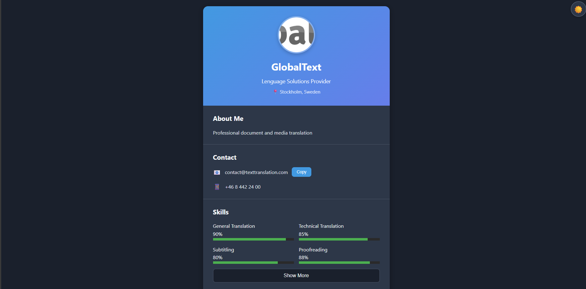
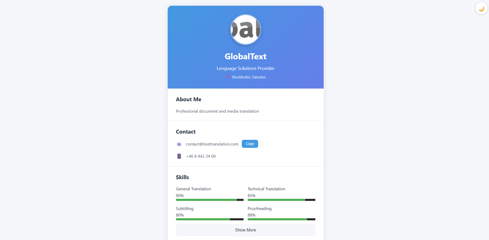

# Ficha de [Tu Dominio] - [Tu Nombre]

## 📋 Información
- **Nombre**: [Juan Andres Rojas Carrascal]
- **Fecha**: [12/02/2026]
- **Dominio Asignado**: [Plataforma de servicios de traduccion]
- **Entidad Principal**: [GlobalText, empresa de servicios profesionales para traduccion ]

## 🎯 Descripción
[Enseña una presentacion, los metodos de contacto para llegar a la pagina,sus habilidades en ciertos campos de la traduccion como lo es el subtitulado, pagina web y estadisticas totales ]

## 📚 Conceptos ES2023 Aplicados
- [] Variables con let/const
- [] Template literals
- [ ] Arrow functions
- [ ] Destructuring
- [ ] Optional chaining (?.)
- [ ] Nullish coalescing (??)

## 🚀 Cómo Ejecutar
1. Abrir index.html en el navegador

## 📸 Screenshots

## 🎯 Autoevaluación
- Funcionalidad: [80]%
- Código ES2023: [100]%
- Código Limpio: [90]%
- Adaptación al Dominio: [80]%
- **Total Estimado**: [85]%