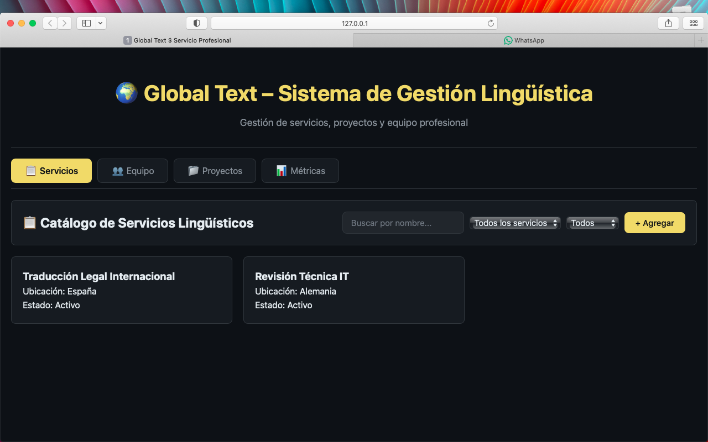
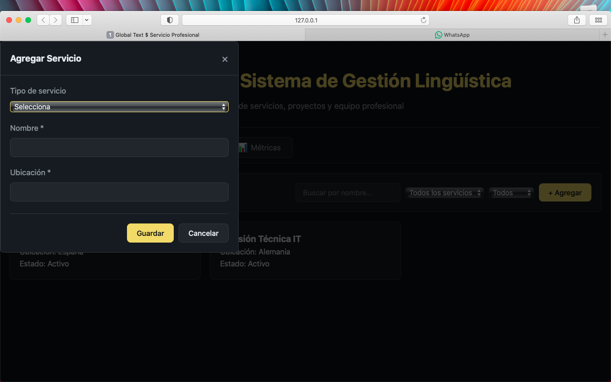
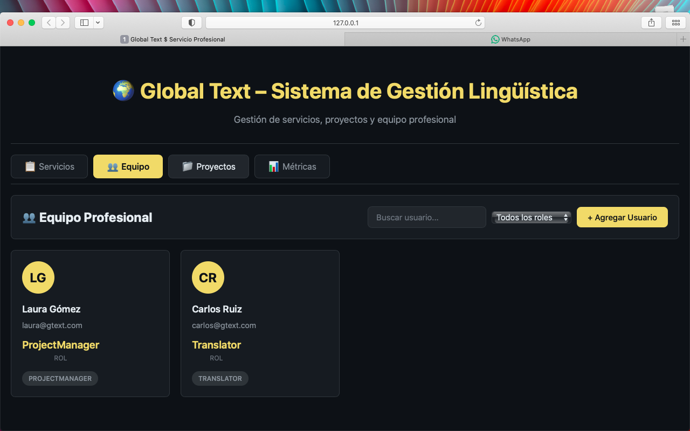

# Ficha de [Plataforma de servicios de traduccion] - [Juan Andres Rojas Carrascal]

## 📋 Información
- **Nombre**: [Juan Andres Rojas Carrascal]
- **Fecha**: [26/02/2026]
- **Dominio Asignado**: [Plataforma de servicios de traduccion]
- **Entidad Principal**: [Global Text]

## 🎯 Descripción
[Enseña una pagina mas interna de la empresa en la que se pueden crear, actualizar y modificar usuarios los cuales poseen roles y correo, tambien estan los servicios los cuales dicen en que estan ambientados, si estan activos y en donde estan ubicados, estan los proyectos que dicen quien los hizo, cuando y su estado de desarollo, y estadisticas que es el total de los 3 campos anteriores,dichos datos estan hechos en el script con clases y subclases]

## 🚀 Cómo Ejecutar
1. Abrir index.html en el navegador

## 📸 Screenshots

## 🎯 Autoevaluación
- Funcionalidad: [90]%
- Código ES2023: [100]%
- Código Limpio: [85]%
- Adaptación al Dominio: [90]%
- **Total Estimado**: [91]%